# 47th ICPC World Final 2023

## Problem I : WaterWorld
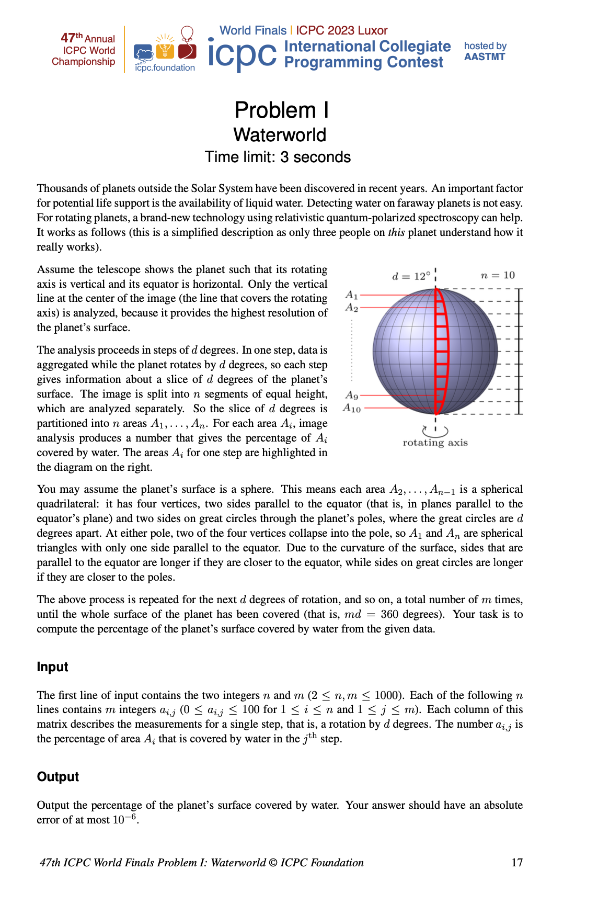
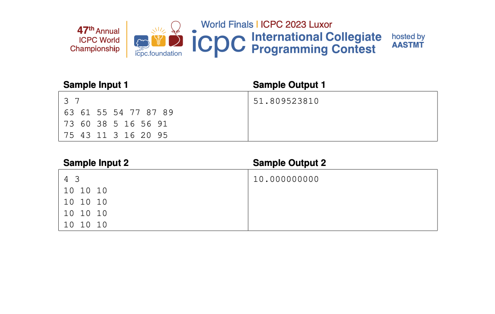

## Solution

```cpp
#include <iomanip>
#include <iostream>
using namespace std;

int main() {
  int n, m;
  while (cin >> n >> m) {
    int a, tot = 0;
    for (int i = 0; i < n*m; i++) {
      cin >> a;
      tot += a;
    }
    cout << fixed << setprecision(9) << (long double)(tot) / (n*m) << endl;
  }
  return 0;
}
```
## Problem B : Schedule
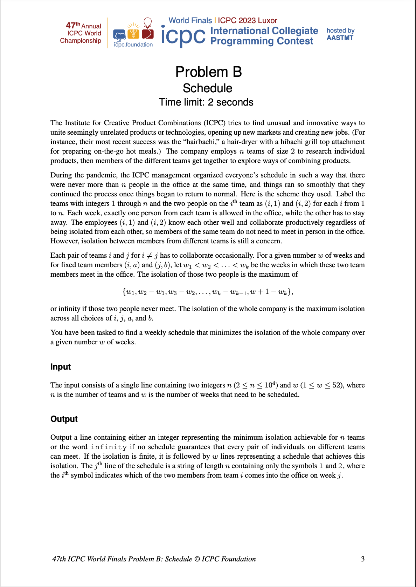
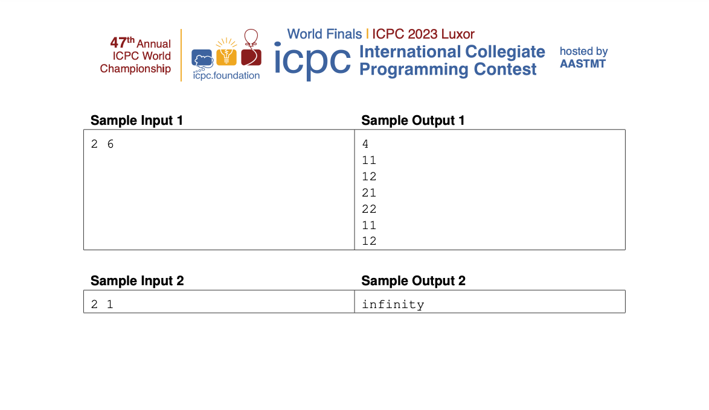

### Solution

```cpp
#include <algorithm>
#include <iostream>
#include <vector>
using namespace std;

int main() {
  int N, W;
  while (cin >> N >> W) {
    int c;
    vector<vector<int>> sch;
    for (c = 4; c <= W; c++) {
      sch.clear();
      vector<int> cur(c, 1);
      for (int i = c/2; i < c; i++) cur[i] = 2;
      do {
        sch.push_back(cur);
        next_permutation(cur.begin(), cur.end());
      } while (cur[0] == 1);
      if (sch.size() >= N) break;
    }
    if (c > W) { cout << "infinity" << endl; continue; }
    cout << c << endl;
    for (int i = 0; i < W; i++) {
      for (int j = 0; j < N; j++) cout << sch[j][i%c];
      cout << endl;
    }
  }
}

```
## Problem H : Jet Lag

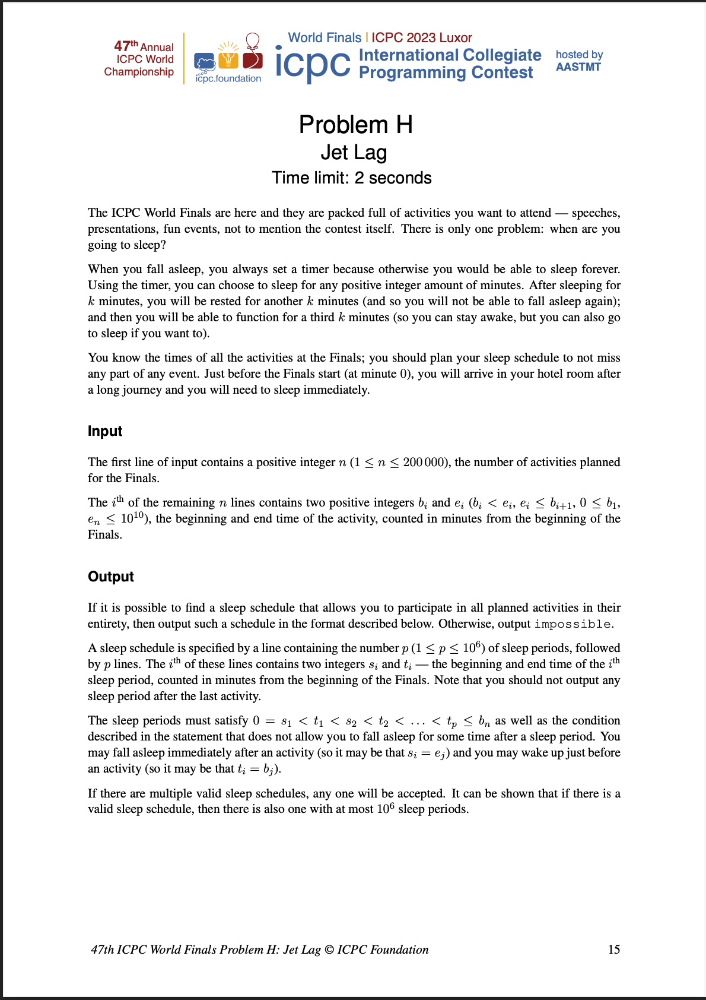
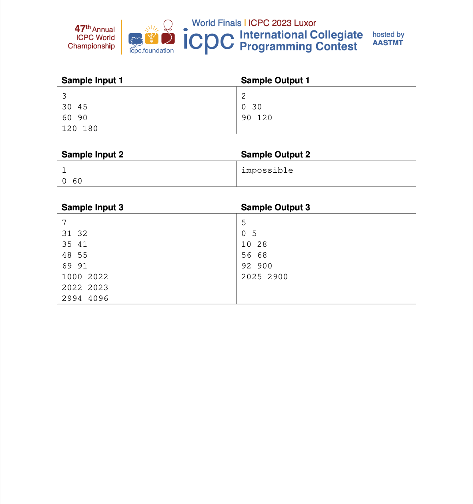

### Solution

```cpp
#include <iostream>
#include <vector>
using namespace std;

int main() {
  int N;
  while (cin >> N) {
    vector<int64_t> B(N+1), E(N+1);
    for (int i = 1; i <= N; i++) cin >> B[i] >> E[i];
    vector<int64_t> S, T;
    for (int i = N, j = i; i > 0;) {
      if (j == 0) goto fail;
      int64_t t = B[j] - (E[i]-B[j]+1)/2;
      if (E[j-1] > t) { j--; continue; }
      if (E[j-1] >= t-1) {
        S.push_back(E[j-1]);
        T.push_back(B[j] - (E[j-1] == t-1 && E[i]-B[j]==1));
      } else {
        S.push_back(t);
        T.push_back(B[j]);
        S.push_back(E[j-1]);
        T.push_back((E[j-1]+t)/2);
      }
      i = --j;
    }
    cout << S.size() << endl;
    for (int i = S.size()-1; i >= 0; i--) cout << S[i] << ' ' << T[i] << endl;
    continue;
fail:
    cout << "impossible" << endl;
  }
}

```
## Problem A : Riddle of the Sphinx
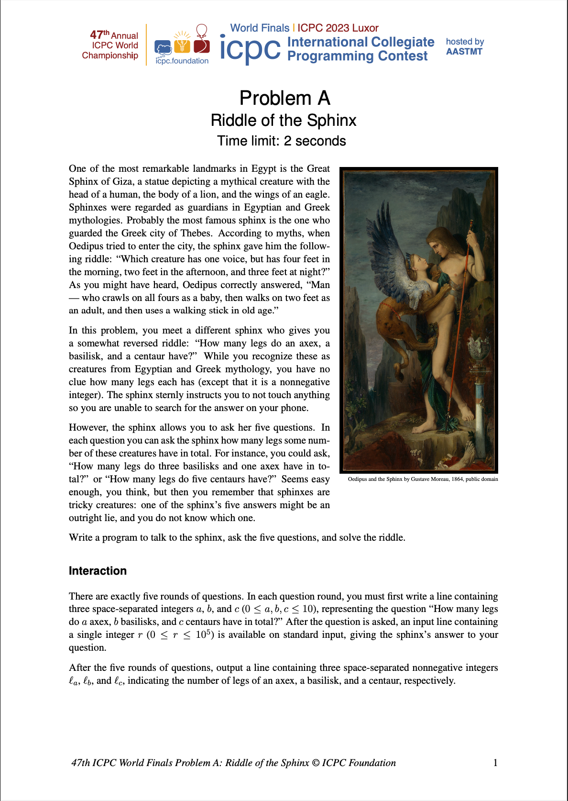
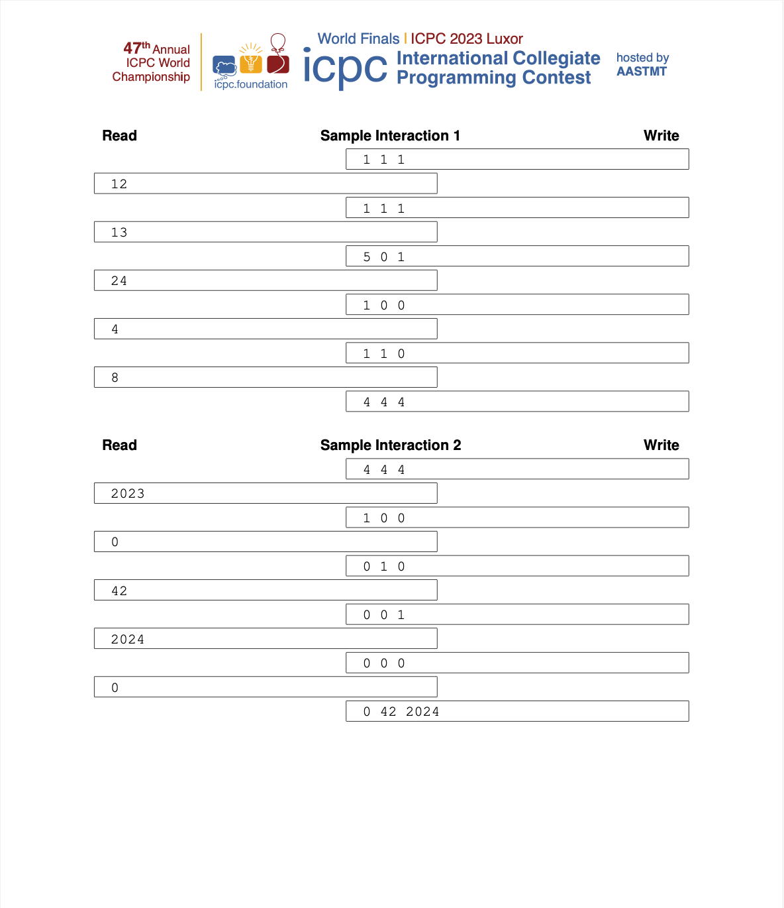

### Solution

```cpp
#include <iostream>
using namespace std;

int main()
{
  int a, b, c, d, e;
  cout << "1 0 0" << endl;
  cin >> a;
  cout << "0 1 0" << endl;
  cin >> b;
  cout << "0 0 1" << endl;
  cin >> c;
  cout << "1 1 1" << endl;
  cin >> d;
  cout << "1 2 3" << endl;
  cin >> e;
  if (a + b + c == d)
    cout << a << ' ' << b << ' ' << c << endl;
  else if (a + 2 * b + 3 * c == e)
    cout << a << ' ' << b << ' ' << c << endl;
  else if ((d - b - c) + 2 * b + 3 * c == e)
    cout << d - b - c << ' ' << b << ' ' << c << endl;
  else if (a + 2 * (d - c - a) + 3 * c == e)
    cout << a << ' ' << d - c - a << ' ' << c << endl;
  else
    cout << a << ' ' << b << ' ' << d - a - b << endl;
}

```
## Problem G : Turning Red
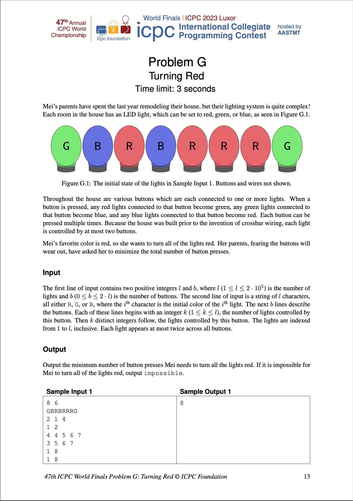
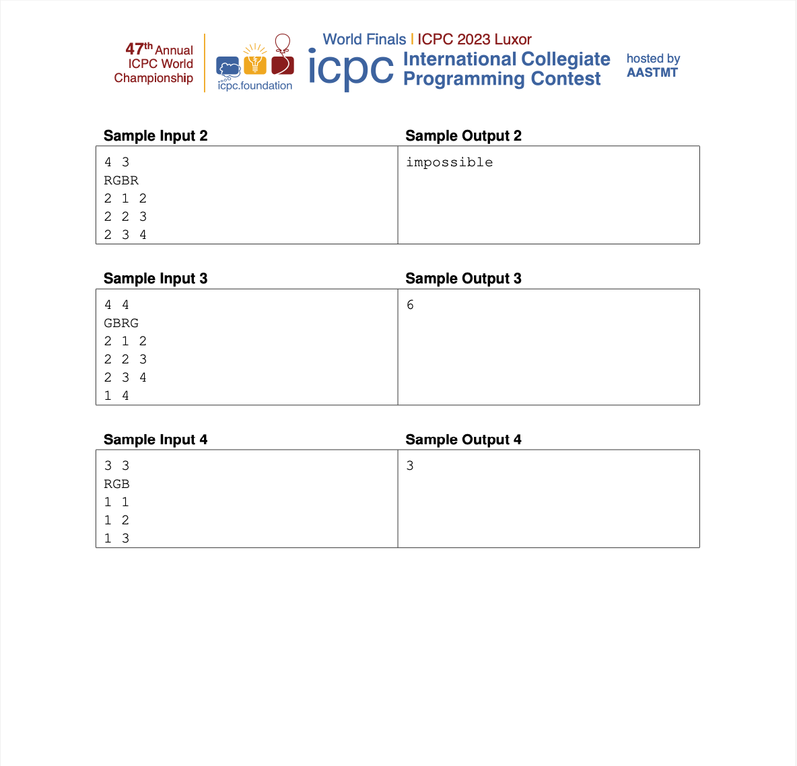

### Solution

```cpp
#include <algorithm>
#include <functional>
#include <iostream>
#include <vector>
using namespace std;

int main() {
  int L, B;
  while (cin >> L >> B) {
    vector<vector<int>> lb(L), bl(B);
    vector<int> ls(L);
    for (int i = 0; i < L; i++) {
      char ch;
      cin >> ch;
      ls[i] = string("RGB").find(ch);
    }
    for (int i = 0; i < B; i++) {
      int K;
      cin >> K;
      bl[i].resize(K);
      for (auto& x : bl[i]) {
        cin >> x; x--;
        lb[x].push_back(i);
      }
    }

    int ret = 0;
    vector<int> push(B, -1);
    for (int j = 0; j < L; j++) if (lb[j].empty() && ls[j] != 0) goto fail;
    for (int i = 0; i < B; i++) if (push[i] == -1 && bl[i].size()) {
      int best = 1e9;
      function<int(int,int,int)> rec = [&](int i, int p, int cookie) -> int {
        if (push[i] >= cookie) return push[i] == cookie+p ? 0 : 1e9;
        push[i] = cookie+p;
        int ret = p;
        for (auto j : bl[i]) if (lb[j].size() == 2) {
          int k = lb[j][0] ^ lb[j][1] ^ i;  // Ooh, I'm so clever.
          ret += rec(k, (12-ls[j]-p)%3, cookie);
          if (ret >= 1e9) return 1e9;
        } else {
          if ((ls[j] + p) % 3 != 0) return 1e9;
        }
        return ret;
      };
      for (int p = 0; p < 3; p++) best = min(best, rec(i, p, p*3));
      if (best == 1e9) goto fail;
      ret += best;
    }

    cout << ret << endl;
    continue;
fail:
    cout << "impossible" << endl;
  }
}
```
## Problem F : Tilting Tiles
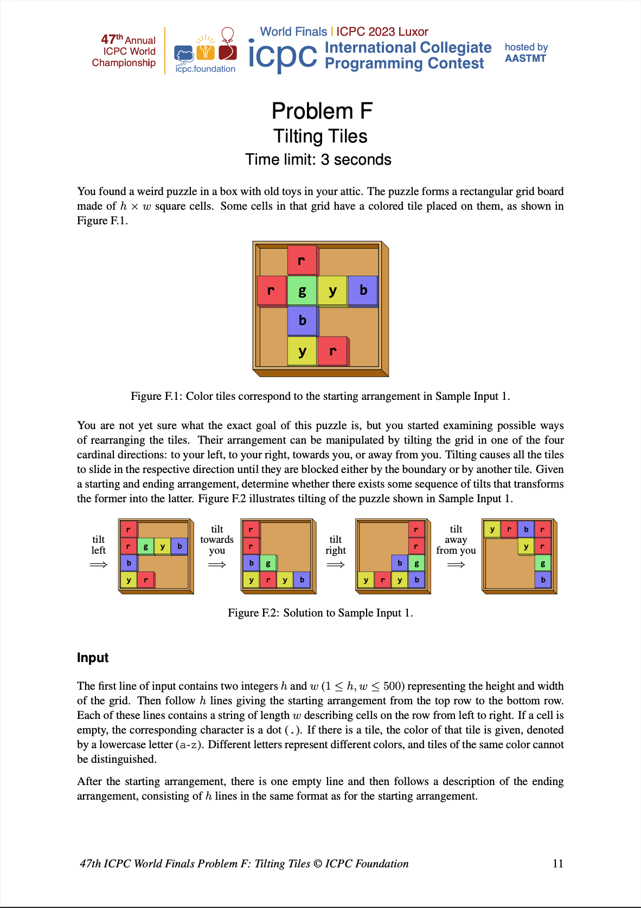
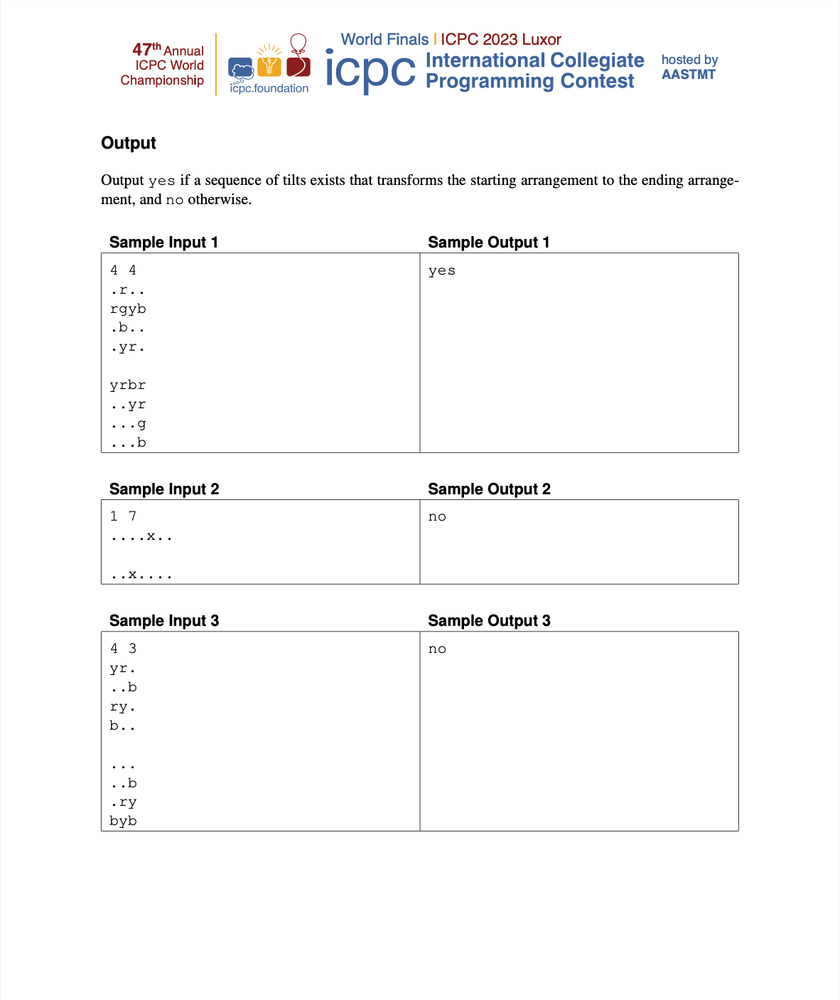

### Solution

```cpp
#include <algorithm>
#include <cstring>
#include <iostream>
#include <string>
#include <vector>
using namespace std;

template<typename T> constexpr T Gcd(const T& a, const T& b) { return b != 0 ? Gcd(b, a%b) : a < 0 ? -a : a; }

void tilt(int dir, vector<vector<int>>& g) {
  int X = g[0].size(), Y = g.size();
  if (dir&1) swap(X, Y);
  auto get = [&](int x, int y) {
    return dir == 0 ? &g[y][x] : dir == 1 ? &g[x][y] : dir == 2 ? &g[y][X-1-x] : &g[X-1-x][y];
  };
  for (int y = 0; y < Y; y++) {
    int x2 = 0;
    for (int x = 0; x < X; x++) if (*get(x, y)) {
      *get(x2++, y) = *get(x, y);
    }
    for (; x2 < X; x2++) *get(x2, y) = 0;
  }
}

pair<int64_t, int64_t> match(const string& s, const string& t) {
  // Who needs hashing/string algorithms?
  int64_t r, m;
  for (r = 0; r <= s.size(); r++) {
    if (r == s.size()) return {0, 0};
    if (memcmp(&s[r], &t[0], s.size()-r) == 0 && memcmp(&s[0], &t[s.size()-r], r) == 0) break;
  }
  for (m = r ? r : 1; m < s.size(); m++) {
    if (s.size() % m == 0 && memcmp(&s[0], &s[m], s.size()-m) == 0) break;
  }
  return {r, m};
}

int main() {
  int Y, X;
  while (cin >> Y >> X) {
    vector<vector<int>> g(Y, vector<int>(X)), g2 = g;
    char ch;
    for (auto& row : g ) for (auto& v : row) { cin >> ch; if (ch != '.') v = ch-'a'+1; }
    for (auto& row : g2) for (auto& v : row) { cin >> ch; if (ch != '.') v = ch-'a'+1; }

    for (int sd = 0; sd < 4; sd++)
    for (int dd = 1; dd < 4; dd += 2) {
      auto tg = g;
      for (int i = 0, d = sd; i <= 6; i++, d = (d+dd)%4) {
        if (tg == g2) goto pass;
        if (i >= 2) {
          auto ng = tg;
          for (int y = 0; y < Y; y++)
          for (int x = 0; x < X; x++) {
            if (!!g2[y][x] != !!ng[y][x]) goto nomatch;
            if (ng[y][x]) ng[y][x] = y*X+x+1;
          }
          for (int j = 0; j < 4; j++) tilt((d+j)%4, ng);
          vector<int64_t> residues, mods;
          for (int y = 0; y < Y; y++)
          for (int x = 0; x < X; x++) if (ng[y][x]) {
            string s, t;
            for (int* ptr = &ng[y][x]; *ptr;) {
              int x2 = (*ptr-1)%X, y2 = (*ptr-1)/X;
              *ptr = 0;
              s += tg[y2][x2]; t += g2[y2][x2];
              ptr = &ng[y2][x2];
            }

            auto [residue, mod] = match(s, t);
            if (mod == 0) goto nomatch;
            if (mod == 1) continue;
            for (int i = 0; i < mods.size(); i++) {
              int64_t g = Gcd(mod, mods[i]);
              if (residues[i] % g != residue % g) goto nomatch;
            }
            //cerr << "Adding r=" << residue << " m=" << mod << endl;
            residues.push_back(residue); mods.push_back(mod);
          }
          goto pass;
        }
nomatch:;
        tilt(d, tg);
      }
    }

fail:
    cout << "no" << endl;
    continue;
pass:
    cout << "yes" << endl;
  }
}
```
## Problem D : Carl's Vacation
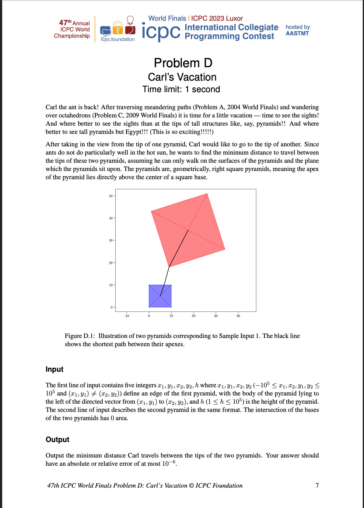
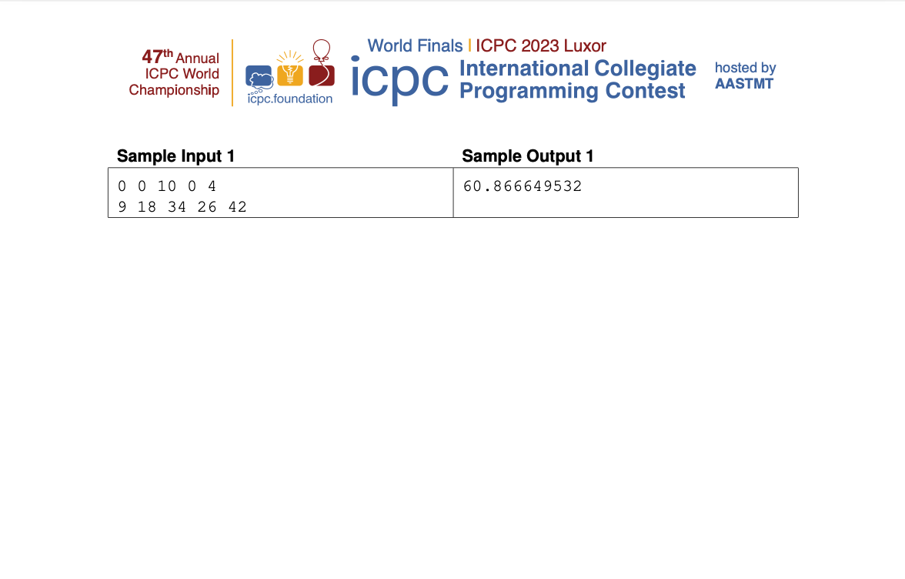

### Solution :

```cpp
#include <algorithm>
#include <cmath>
#include <iomanip>
#include <iostream>
using namespace std;

struct Point {
  double x, y;
  Point operator+(const Point& p) const { return Point{x+p.x, y+p.y}; }
  Point operator-(const Point& p) const { return Point{x-p.x, y-p.y}; }
  Point operator*(double c) const { return Point{c*x, c*y}; }
  double len() const { return hypot(x, y); }
};

// Positive if b points counterclockwise of a.
inline double CrossProd(const Point& a, const Point& b) {
  return a.x*b.y - a.y*b.x;
}

bool Intersect(const Point& a1, const Point& a2, const Point& b1, const Point& b2) {
  double cp1 = CrossProd(a2-a1, b1-a1);
  double cp2 = CrossProd(a2-a1, b2-a1);
  if (cp1 < -1e-9 && cp2 < -1e-9) return false;
  if (cp1 >  1e-9 && cp2 >  1e-9) return false;
  cp1 = CrossProd(b2-b1, a1-b1);
  cp2 = CrossProd(b2-b1, a2-b1);
  if (cp1 < -1e-9 && cp2 < -1e-9) return false;
  if (cp1 >  1e-9 && cp2 >  1e-9) return false;
  return true;
}

int main() {
  Point a1, a2, b1, b2;
  double ah, bh;
  while (cin >> a1.x >> a1.y >> a2.x >> a2.y >> ah >> b1.x >> b1.y >> b2.x >> b2.y >> bh) {
    double aSideLen = (a2-a1).len();
    double bSideLen = (b2-b1).len();
    double aDiagLen = sqrt(aSideLen*aSideLen/2 + ah*ah);
    double bDiagLen = sqrt(bSideLen*bSideLen/2 + bh*bh);
    double aAltLen = sqrt(aSideLen*aSideLen/4 + ah*ah);
    double bAltLen = sqrt(bSideLen*bSideLen/4 + bh*bh);
    double ret = 1e9;
    for (int ai = 0; ai < 4; ai++) {
      Point ap{a1.y-a2.y, a2.x-a1.x};
      Point amid{(a1+a2)*0.5 + ap*0.5};
      for (int bi = 0; bi < 4; bi++) {
        Point bp{b1.y-b2.y, b2.x-b1.x};
        Point bmid{(b1+b2)*0.5 + bp*0.5};

        for (int aDiag = 0; aDiag < 2; aDiag++) {
          Point at = aDiag ? a1 : (a1+a2)*0.5 + ap*(aAltLen/aSideLen);
          double alen = aDiag ? aDiagLen : 0.0;
          for (int bDiag = 0; bDiag < 2; bDiag++) {
            Point bt = bDiag ? b1 : (b1+b2)*0.5 + bp*(bAltLen/bSideLen);
            double blen = bDiag ? bDiagLen : 0.0;
            if (!aDiag && (CrossProd(bmid-a1, a2-a1) < 0 || !Intersect(a1, a2, at, bt))) continue;
            if (!bDiag && (CrossProd(amid-b1, b2-b1) < 0 || !Intersect(b1, b2, at, bt))) continue;
            ret = min(ret, alen + blen + (bt-at).len());
          }
        }

        b1 = b2+bp; swap(b1, b2);
      }
      a1 = a2+ap; swap(a1, a2);
    }
    cout << fixed << setprecision(9) << ret << endl;
  }
}
```
## Problem J : Bridging The Gap
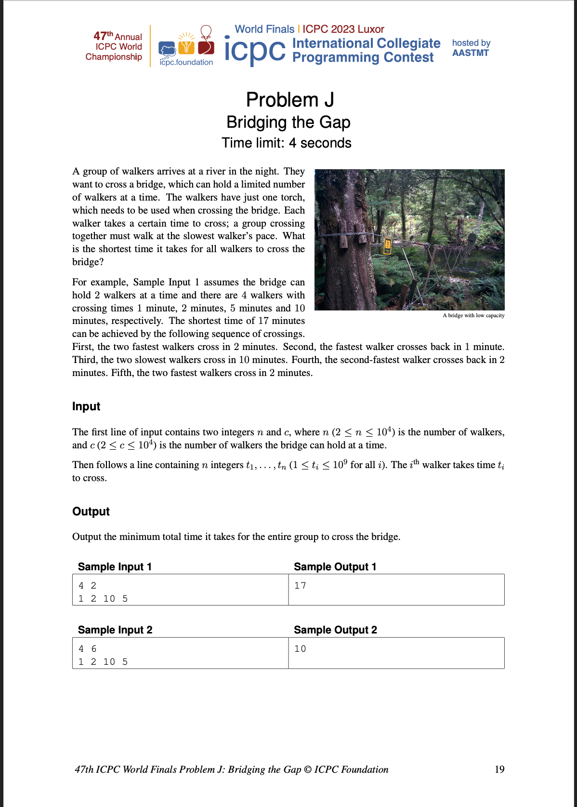

### Solution :

```cpp
#include <algorithm>
#include <iostream>
#include <vector>
using namespace std;

int main() {
  int64_t N, C;
  while (cin >> N >> C) {
    vector<int64_t> T(N);
    for (auto& x : T) cin >> x;
    sort(T.begin(), T.end());

    vector<int64_t> tot(N+1, 1e18), cc(N, 1e18);
    tot[0] = cc[0] = 0;
    for (int64_t i = 0; i < N; i++) tot[i+1] = tot[i] + T[i];
    for (int64_t i = 1; i < C && i < N; i++) {
      for (int64_t j = i; j < cc.size(); j++) cc[j] = min(cc[j], cc[j-i] + T[i] + tot[i+1]);
    }
//for (int i = 0; i < N; i++) cerr << "cc[" << i << "] = " << cc[i] << endl;

    vector<int64_t> mnc(N+1), mxc(N+1);
    vector<vector<int64_t>> dyn(N+1);
    for (int64_t i = 0; i <= N; i++) mnc[i] = -(i/C) - (i==N);
    for (int64_t i = 0; i <= N; i++) mxc[i] = (N-i+C-1)/C-1;
    for (int64_t i = 0; i <= N; i++) dyn[i].resize(mxc[i]-mnc[i]+1, 1e18);
    dyn[0][0] = 0;
    for (int64_t i = 0; i < N; i++)
    for (int64_t ci = 0; ci < dyn[i].size(); ci++) {
      if (ci && dyn[i][ci] - dyn[i][0] >= cc[ci]) continue;
      int64_t c = mnc[i]+ci;
      for (int64_t j = min(N, i+C), extra = -1; j > i; j--, extra++) {
        int64_t c2 = c + extra;
        if (c2 > mxc[j]) break;
        dyn[j][c2-mnc[j]] = min(dyn[j][c2-mnc[j]], dyn[i][ci] + T[N-1-i] + tot[extra+1]);
      }
    }

    int64_t ret = 1e18;
    for (int64_t c = mnc[N]; c <= -1; c++) ret = min(ret, dyn[N][c-mnc[N]] + cc[-1-c]);
    cout << ret << endl;
  }
}
```

## Problem K : Alea Lacta Est
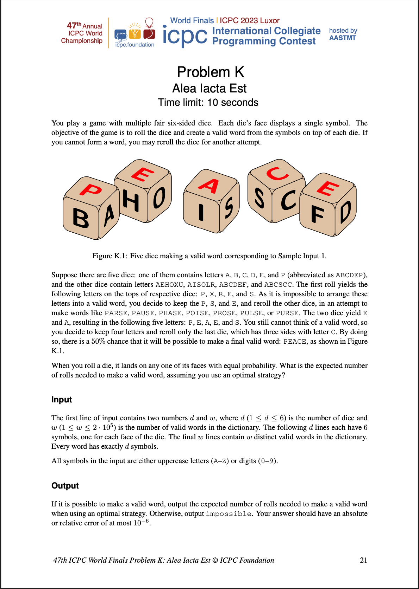
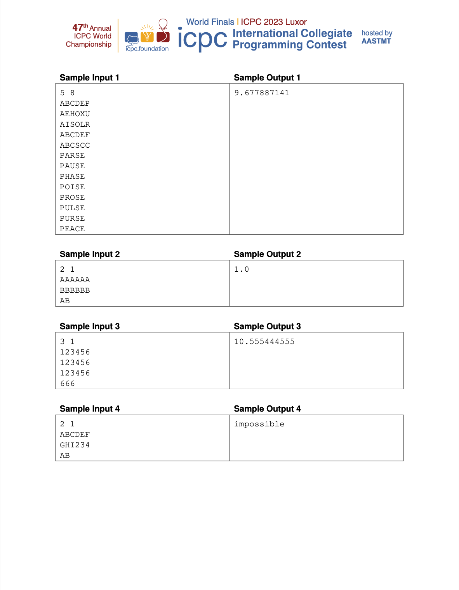

### Solution :

```cpp
#include <algorithm>
#include <cmath>
#include <functional>
#include <iomanip>
#include <iostream>
#include <map>
#include <queue>
#include <string>
#include <vector>
using namespace std;

int main() {
  int N, W;
  while (cin >> N >> W) {
    vector<string> D(N);
    for (auto& d : D) cin >> d;

    map<string, vector<int>> dw;
    function<void(int,int,string)> doit = [&](int d, int b, string s) {
      if (d == N) {
        sort(s.begin(), s.end());
        dw[s].push_back(b);
        return;
      }
      for (int i = 0; i < D[d].size(); i++) doit(d+1, b + ((i+1)<<(3*d)), s+D[d][i]);
    };
    doit(0, 0, "");

    vector<int> curn(1<<(3*N)), seen(1<<(3*N));
    vector<double> cure(1<<(3*N)), beste(1<<(3*N), 1e9);
    priority_queue<pair<double, int>> q;
    // For a solved full configuration, adjust the expected values of partial configurations that may roll it.
    function<void(int,int,int,double)> sete = [&](int d, int pw, int b, double e) {
      if (d == N) {
        if (pw == 1) return;
        curn[b]++;
        cure[b] += e;
        // We know that be = 1 + ((pw-curn) / pw) * be + (curn / pw) * (cure/curn).
        double be = (pw + cure[b]) / curn[b];
        beste[b] = be;
        q.push({-be, b});
        return;
      }
      sete(d+1, pw, b, e);
      sete(d+1, pw*D[d].size(), b & ~(7<<(3*d)), e);
    };
    // For a solved partial configuration, any unsolved full configurations that can reach it are now solved.
    function<void(int,int,double)> brec = [&](int d, int b, double e) {
      if (d == N) {
        if (!seen[b]) sete(0, 1, b, e);
        seen[b] = true;
        return;
      }
      if (b&(7<<(3*d))) {
        brec(d+1, b, e);
      } else {
        for (int i = 0; i < D[d].size(); i++) brec(d+1, b + ((i+1)<<(3*d)), e);
      }
    };

    for (int i = 0; i < W; i++) {
      string w;
      cin >> w;
      sort(w.begin(), w.end());
      for (auto b : dw[w]) brec(0, b, 0.0);
    }

    if (q.empty()) { cout << "impossible" << endl; continue; }
    while (!q.empty()) {
      auto [e, b] = q.top(); q.pop(); e = -e;
      if (seen[b]) continue;
      seen[b] = true;
//for (int d = 0; d < N; d++) if (b&(7<<(3*d))) cout << D[d][((b>>(3*d))&7)-1]; else cout << '.';
//cout << ": " << e << endl;
      // Configuration b is now solved.
      brec(0, b, e);
    }

    cout << fixed << setprecision(9) << beste[0] << endl;
  }
}
```
## Problem E : A Recurring Problem
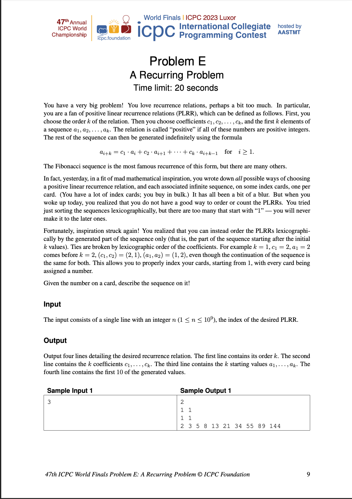


### Solution :

```cpp
#include <algorithm>
#include <cstring>
#include <iostream>
#include <map>
#include <vector>
using namespace std;

int64_t memo1[51];
int64_t count1(int64_t n) {
  if (n == 0) return 1;
  int64_t& ret = memo1[n];
  if (ret) return ret;
  for (int64_t a = 1; a <= n; a++)
  for (int64_t c = 1; a*c <= n; c++) {
    ret += count1(n - a*c);
  }
  return ret;
}

// Returns # of possible next elements for generated sequences matching "seq".
map<pair<vector<int64_t>, vector<int64_t>>, map<int64_t,int64_t>> memo;
vector<int64_t> curc, cura;
vector<tuple<vector<int64_t>, vector<int64_t>, vector<int64_t>>> saved;
const map<int64_t,int64_t>& count(vector<int64_t> seq, vector<int64_t> prev, bool save) {
  static map<int64_t,int64_t> empty{}, base{{0,1}};
  if (seq[0] == 0) {
    for (int i = 1; i < seq.size(); i++) if (seq[i]) return empty;
    if (save) {
      vector<int64_t> curs = cura;
      while (curs.size() < curc.size()+30) {
        int64_t x = 0;  // There may be some overflow, but this shouldn't affect relative sorting.
        for (int i = 0; i < curc.size(); i++) x += curs[curs.size()-curc.size()+i] * curc[i];
        curs.push_back(x);
      }
      curs.erase(curs.begin(), curs.begin()+curc.size());
      saved.push_back({curs, curc, cura});
    }
    return base;
  }
  for (auto x : seq) if (x <= 0) return empty;

  if (seq.size() >= 2) {
    vector<int64_t> seq2 = seq, prev2 = prev;
    seq2.pop_back(); prev2.pop_back();
    auto it = memo.find({seq2, prev2});
    if (it == memo.end() || !it->second.count(seq.back())) return empty;
  }

  auto [it, inserted] = memo.insert({{seq, prev}, empty});
  map<int64_t,int64_t>& ret = it->second;
  if (save) { ret.clear(); inserted = true; }
  if (!inserted) return ret;

  prev.insert(prev.begin(), 0);
  for (int64_t c = 1;   c <= seq[0]; c++)
  for (int64_t a = 1; a*c <= seq[0]; a++) {
    prev[0] = a;
    for (int i = 0; i < seq.size(); i++) seq[i] -= prev[i]*c;
    int64_t tmp = prev.back();
    prev.pop_back();

    if (save) { curc.insert(curc.begin(), c); cura.insert(cura.begin(), a); }
    for (auto [v, n] : count(seq, prev, save)) ret[v + tmp*c] += n;
    if (save) { curc.erase(curc.begin()); cura.erase(cura.begin()); }

    prev.push_back(tmp);
    for (int i = 0; i < seq.size(); i++) seq[i] += prev[i]*c;
  }
  return ret;
}

int main() {
  int64_t N;
  while (cin >> N) {
    memo.clear(); cura.clear(); curc.clear(); saved.clear();

    vector<int64_t> seq;
    for (int64_t n = 1; ; n++) {
      if (count1(n) < N) N -= count1(n); else { seq.push_back(n); break; }
    }
    while (seq.size() < 30 && seq.back() < 1e16) {
      auto m = count(seq, seq, false);
      int64_t tot = 0;
      for (auto [v, n] : m) {
        if (n < N) {
          N -= n;
        } else {
          seq.push_back(v);
          if (n <= 20) goto done;  // Small enough to brute force.
          break;
        }
      }
    }
done:

    count(seq, seq, true);
    sort(saved.begin(), saved.end());
    auto [sv, cv, av] = saved[N-1];
    cout << cv.size() << endl;
    for (int i = 0; i < cv.size(); i++) { if (i) cout << ' '; cout << cv[i]; }
    cout << endl;
    for (int i = 0; i < av.size(); i++) { if (i) cout << ' '; cout << av[i]; }
    cout << endl;
    for (int i = 0; i < 10; i++) { if (i) cout << ' '; cout << sv[i]; }
    cout << endl;
  }
}
```

## Problem C : Three Kinds of Dice
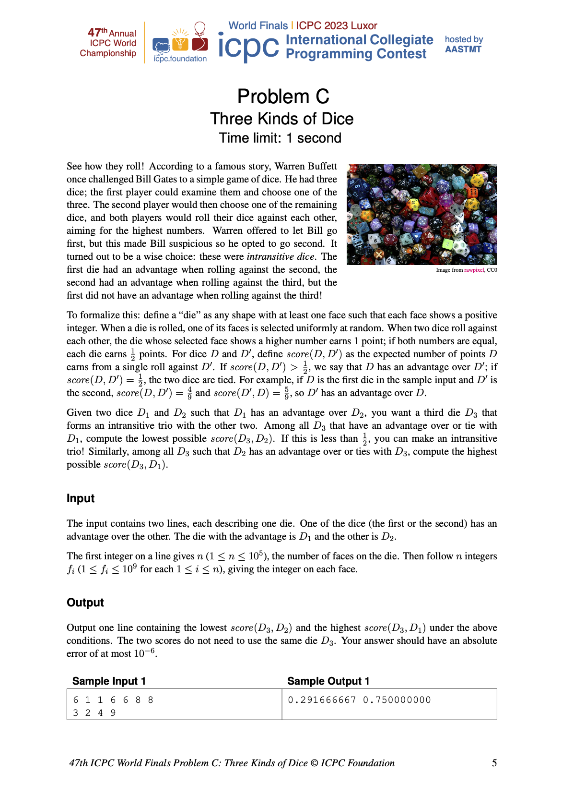
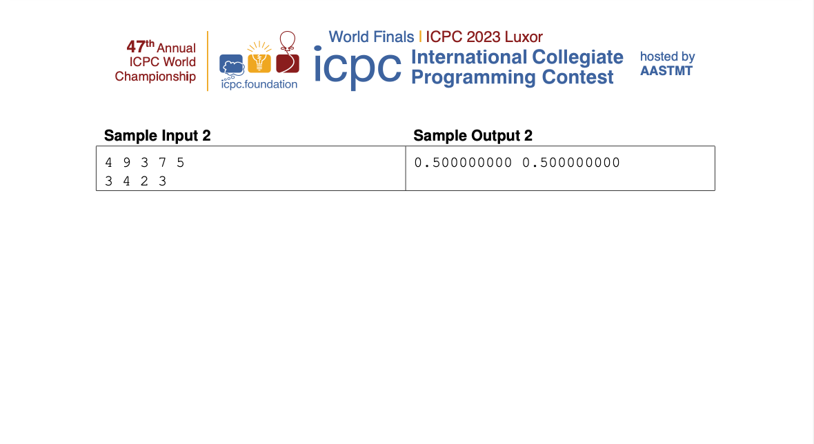

### Solution :
```cpp
#include <algorithm>
#include <cassert>
#include <iomanip>
#include <iostream>
#include <vector>
using namespace std;

int main() {
  int64_t N1, N2;
  while (cin >> N1) {
    vector<int> D1(N1);
    for (auto& x : D1) cin >> x;
    cin >> N2;
    vector<int> D2(N2);
    for (auto& x : D2) cin >> x;
    sort(D1.begin(), D1.end());
    sort(D2.begin(), D2.end());
    D1.push_back(2e9);
    D2.push_back(2e9);

    // Ensure D1 beats D2.
    int64_t prob = 0;
    for (int i1 = 0, i2 = 0, j2 = 0; i1 < N1; i1++) {
      while (D2[i2] < D1[i1]) i2++;
      while (D2[j2] <= D1[i1]) j2++;
      prob += 2*i2 + (j2-i2);
    }
    //cerr << "D1 beats D2 prob: " << prob/2.0/N1/N2 << endl;
    assert(prob != N1*N2);
    if (prob < N1*N2) { swap(N1, N2); swap(D1, D2); }

    vector<int> poss;
    for (auto x : D1) { if (x > 1) poss.push_back(x-1); poss.push_back(x); poss.push_back(x+1); }
    for (auto x : D2) { if (x > 1) poss.push_back(x-1); poss.push_back(x); poss.push_back(x+1); }
    sort(poss.begin(), poss.end());
    poss.erase(unique(poss.begin(), poss.end()), poss.end());
    while (poss.back() > 1.5e9) poss.pop_back();
    vector<pair<double, double>> v;
    for (int pi = 0, i1 = 0, i2 = 0, j1 = 0, j2 = 0; pi < poss.size(); pi++) {
      while (D1[i1] < poss[pi]) i1++;
      while (D2[i2] < poss[pi]) i2++;
      while (D1[j1] <= poss[pi]) j1++;
      while (D2[j2] <= poss[pi]) j2++;
      v.emplace_back((2*i1+(j1-i1)) / 2.0 / N1,
                     (2*i2+(j2-i2)) / 2.0 / N2);
    }

    for (int rep = 0; rep < 2; rep++) {
      vector<int> hull;
      for (int i = 0; i < v.size(); i++) {
        while (hull.size() >= 2) {
          auto [x1, y1] = v[hull[hull.size()-2]];
          auto [x2, y2] = v[hull[hull.size()-1]];
          auto [x3, y3] = v[i];
          if ((x3-x1)*(y2-y1) < (x2-x1)*(y3-y1)) break;
          hull.pop_back();
        }
        hull.push_back(i);
      }

      double ret = 1.0;
      for (int i = 0; i+1 < hull.size(); i++) {
        auto [x1, y1] = v[hull[i]];
        auto [x2, y2] = v[hull[i+1]];
        if (x1 >= 0.5 || x2 < 0.5) continue;
        ret = y1 + (y2-y1)/(x2-x1)*(0.5-x1);
      }
      if (!rep) cout << fixed << setprecision(9) << ret << ' '; else cout << 1-ret << endl;

      for (auto& [v1, v2] : v) { swap(v1, v2); v1 = 1-v1; v2 = 1-v2; }
      reverse(v.begin(), v.end());
      reverse(poss.begin(), poss.end());
    }
  }
}

```